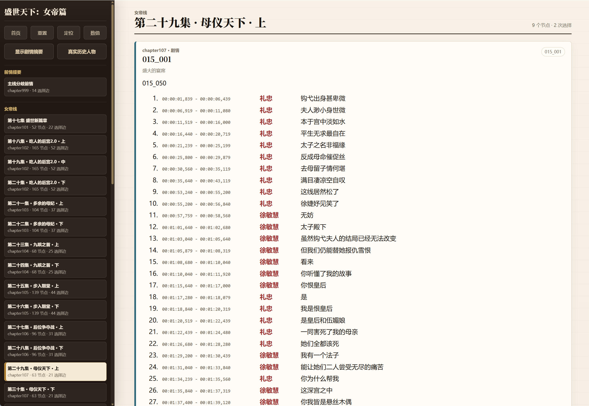
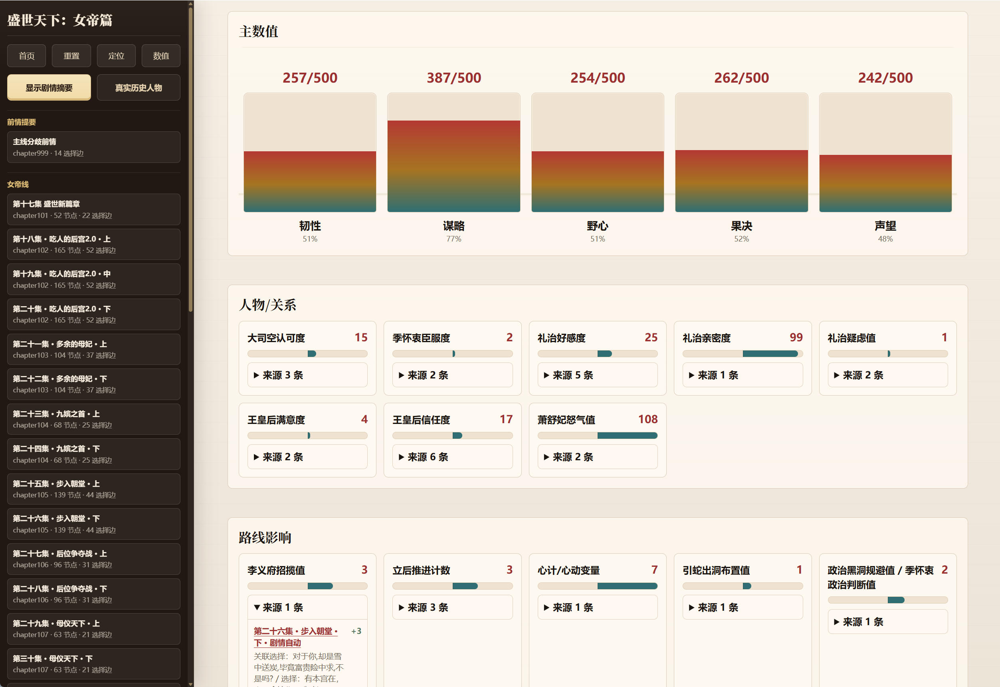
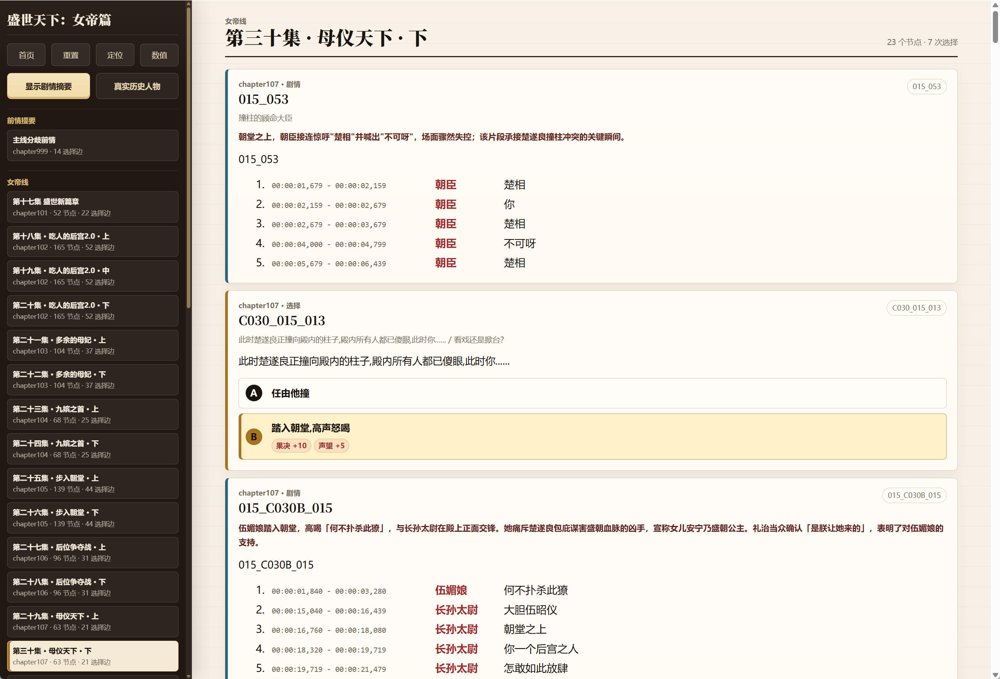
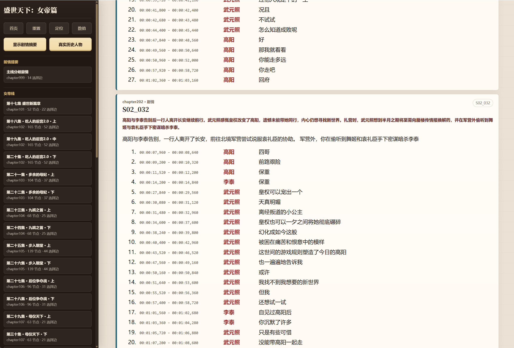

# 《盛世天下：女帝篇》剧情路线模拟器 / SSTX2 RoadToEmpress Story Simulator


分支解锁选到头秃？文字攻略只写 ABC？流程视频翻到想吐？这份剧情路线模拟器把选择、分支、数值和剧情上下文整理成一张可以直接查询的路线图。

本仓库把游戏中的剧情节点、选择分支、视频字幕、数值影响、人物/物品档案和剧情摘要整理成可运行、可检索、可维护的开源资料。它不包含游戏本体、视频、音频或可替代购买游戏的资源。

## 在线使用

在线地址：[《盛世天下：女帝篇》剧情路线模拟器](https://liu-bot24.github.io/SSTX2-RoadToEmpress-StorySimulator/data/game/storyline_graph/storyline_graph.html)

## 核心内容

- 交互式剧情路线图：按真实剧情图展示视频节点、选择节点、分支、合流、坏结局和后续跳转。
- 数值追踪：整理选项、剧情视频和特殊节点带来的属性变化，支持在页面中查看路线累计影响。
- 说话人字幕：按剧情顺序重组字幕，AI 生成说话人，保留时间码、前后节点和选择上下文。
- 剧情知识库：提供人物档案、物品/概念档案、别名导航、关系链、字幕片段和视频摘要。
- 历史称谓显示层：在模拟器页面中可切换为真实历史人物语境，且不覆盖原始游戏文本。
- 游戏字幕补丁包：独立的《盛世天下：女帝篇》历史称谓补丁，可用于游戏本体本地文本替换。

## 截图演示

### 路径选择模拟与说话人标注
在 AI 推理标注的基础上花了两天进行了人工说话人校验，但难免错漏，欢迎提交 PR。



### 游戏数值模拟
人物关系数值和剧情推进数值基本都是准的，主数值5项仅作参考。不是我不愿意做准确，实在是游戏里面能拿到的数值文本就有些乱，甚至有些地方前后不一致。


### AI 剧情摘要提炼
小字的总结为 AI 结合知识库提炼，其下方为游戏内文本自身包含的摘要，如无自带摘要则为字幕。


### 真实历史人物名称显示
还原真实历史人物的姓名与称谓。


## 目录结构

```text
data/
├─ game/
│  ├─ storyline_graph/          剧情模拟器页面、路线图、数值表、字幕和显示层数据
│  └─ storyline_mechanics/      条件、全局变量、视频效果等机制数据
├─ knowledge/                   剧情知识库
└─ runtime/                     本地运行产物和临时输出，默认忽略

docs/
└─ architecture/                数据流、知识库、说话人字幕和摘要显示层架构文档

src/
└─ road_state_tracker/          配置解析、文本索引、运行状态、档案导出等 Python 模块

tools/                          构建、同步、导出和验证脚本

tests/                          项目级测试

sstx2-historical-text-patch/    独立游戏本体历史称谓补丁包
```

## 知识库和架构

知识库位于 `data/knowledge/`，核心目标是把剧情资料整理成稳定、可引用、可检索的 Markdown 文档和结构化索引。具体视频内容、人物关系、物品概念、别名导航和摘要资料都从这里进入。

主要入口：

- `data/knowledge/README.md`：知识库目录总览。
- `data/knowledge/AGENT_GUIDE.md`：检索边界、证据优先级和资料使用规则。
- `data/knowledge/storyline_guide.md`：剧情路线图、节点、选择和合流关系说明。
- `data/knowledge/video_subtitles/`：按剧情顺序整理的字幕片段，每个剧情视频对应一份 Markdown。
- `data/knowledge/video_summaries/`：剧情摘要资料，每个剧情视频对应一份 Markdown，并同步给页面显示层。
- `data/knowledge/dossiers/`：人物、物品、别名、关系链、解锁线索和参考资料。

架构文档位于 `docs/architecture/`：

- `knowledge-base-architecture.md`：知识库整体结构和证据边界。
- `agent-wiki-architecture.md`：知识导航和索引方式。
- `storyline-graph-coverage.md`：剧情图恢复范围和数据覆盖。
- `speaker-attribution-architecture.md`：说话人字幕的来源和同步链路。
- `video-summary-overlay-architecture.md`：视频摘要显示层和同步链路。

这套结构的维护原则是：长期内容写在可审阅的源文件里，页面读取派生数据；如果字幕、摘要、人物档案或称谓资料需要修正，应优先修改对应源文档，再同步到页面使用的数据。

## 历史称谓补丁包

下载：

- GitHub Release 一键包：[sstx2-historical-text-patch-20260625.zip](https://github.com/Liu-Bot24/SSTX2-RoadToEmpress-StorySimulator/releases/download/sstx2-historical-text-patch-20260625/sstx2-historical-text-patch-20260625.zip)
- 百度网盘三包合集：[https://pan.baidu.com/s/1O2hu3kD1WNg50Z7zKHPpiw?pwd=ktui](https://pan.baidu.com/s/1O2hu3kD1WNg50Z7zKHPpiw?pwd=ktui)，提取码：`ktui`

百度网盘里包含三个文件：

- `sstx2-historical-text-patch-20260625.zip`：一键包。通过脚本执行全部替换、谐音替换或还原原文，会自动处理在线字幕屏蔽和备份。
- `sstx2-historical-text-direct-all-20260625.zip`：全部替换直接解压版。解压后直接覆盖游戏目录中的对应 `Data` 文件。
- `sstx2-historical-text-direct-phonetic-20260625.zip`：谐音替换直接解压版。只覆盖谐音/近音规避项对应的游戏文件。

详细说明：

[sstx2-historical-text-patch/README.md](sstx2-historical-text-patch/README.md)

### 一键包使用方式

1. 关闭游戏。
2. 解压 `sstx2-historical-text-patch-20260625.zip`。
3. 把解压出来的整个 `sstx2-historical-text-patch` 文件夹放到游戏根目录，和 `Data` 文件夹同级。
4. 双击 `sstx2-history-patch.bat`。
5. 在菜单中选择 `全部替换`、`谐音替换` 或 `还原原文`。

补丁支持三种操作：

- 全部替换：尽量把游戏显示文本恢复到真实历史人物语境。
- 谐音替换：只替换谐音或近似规避写法，降低与语音不一致的程度。
- 还原原文：恢复补丁备份的文本，并移除补丁写入的在线字幕屏蔽。

### 直接解压版使用方式

如果不方便运行脚本，可以使用百度网盘中的直接解压版。

1. 关闭游戏。
2. 根据需要下载其中一个直接解压版：
   - `sstx2-historical-text-direct-all-20260625.zip`：全部替换。
   - `sstx2-historical-text-direct-phonetic-20260625.zip`：谐音替换。
3. 打开游戏根目录，也就是能看到 `Data` 文件夹和 `sstx2.exe` 的目录。
4. 把直接解压版压缩包解压到游戏根目录。
5. 如果系统提示是否合并/覆盖 `Data` 文件夹和同名文件，选择合并并覆盖。

直接解压版不会创建补丁备份，也不会自动修改 `hosts`。如果需要恢复原文，请通过 Steam 验证游戏文件完整性。不要在已经覆盖了全部替换版的情况下直接再覆盖谐音替换版；如果要从全部替换切换到谐音替换，请先通过 Steam 验证游戏文件完整性，再覆盖谐音替换版。

直接解压版只负责覆盖本地文件。如果要让视频字幕也使用本地已替换字幕，需要自己屏蔽在线字幕域名。可以用管理员权限打开系统 `hosts` 文件，手动加入：

```text
127.0.0.1 eo.roadtoempress.com
```

Windows 的 `hosts` 文件通常在：

```text
C:\Windows\System32\drivers\etc\hosts
```

如果不想手动改 `hosts`，请使用一键包；一键包会自动写入和移除这条屏蔽记录。

视频字幕的显示机制会优先使用在线字幕资源。补丁会通过 `hosts` 屏蔽在线字幕域名，让游戏回落到本地已替换的字幕文件，因此运行时可能需要管理员权限。

一键包会自动写入和移除以下 `hosts` 记录：

```text
127.0.0.1 eo.roadtoempress.com
```

如果补丁已经替换了本地文件，但视频字幕仍未变化，可以检查系统 `hosts` 文件中是否存在这条记录。还原原文时，补丁会移除由它写入的屏蔽记录。

### 补丁效果示例


## 维护和贡献

欢迎提交 PR 修正以下内容：

- 剧情路线图节点、选择、合流关系错误。
- 数值影响、条件判断、特殊节点归因错误。
- 说话人标注错误。
- 视频摘要不准确或表达不清。
- 人物、物品、别名和关系链资料错误。
- 历史称谓映射遗漏或误替换。
- 补丁包 README 或脚本问题。

常用维护入口：

- 说话人字幕：`data/knowledge/video_subtitles/docs/*.subtitles.md`
- 剧情摘要：`data/knowledge/video_summaries/docs/*.summary.md`
- 人物档案：`data/knowledge/dossiers/characters/*.md`
- 物品/概念档案：`data/knowledge/dossiers/items/*.md`

提交修正时，请尽量指出对应的剧情位置，例如章节、选择文本、字幕片段、人物/物品档案或页面位置。涉及说话人和摘要时，优先修改 Markdown 源文档。

## 版权说明和免责声明

本仓库是面向《盛世天下：女帝篇》的非商业资料整理、路线模拟和辅助分析项目。游戏版权、商标、角色、剧情、视频、音频、美术资源和原始素材归其权利方所有。

本仓库不提供游戏本体，不提供视频、音频或可替代正版游戏体验的资源，也不用于规避购买、下载或访问正版游戏。仓库中的文字资料、路线数据、摘要和补丁仅用于学习、研究、资料整理、无障碍检索和个人本地化使用。

如果权利方认为本仓库中的任何内容不应公开展示，请通过 Issue 联系维护者处理。
